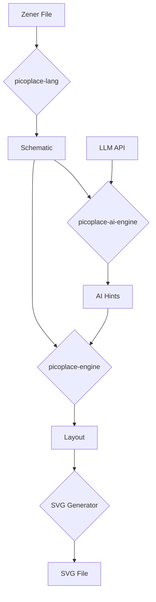

# Design for AI-Powered Placer-Router

This document outlines the design and architecture for enhancing the `picoplace` tool with AI-driven placement and routing hints, along with an improved SVG layout visualizer.

## 1. System Architecture

The proposed architecture extends the existing `picoplace` workspace with new components for AI integration and improved layout generation. The core components and their interactions are illustrated below:



### New and Modified Components

*   **`picoplace-ai-engine` (New Crate):** This new crate will be responsible for interacting with the LLM API to get placement and routing hints. It will take the `Schematic` as input, generate appropriate prompts for the LLM, and parse the LLM's response into a structured `AIHints` object.

*   **`picoplace-engine` (Modified):** The existing `placer` and a new `router` module will be updated to consume the `AIHints`. The placer will use the hints to guide the initial placement of components, and the router will use them to prioritize critical nets.

*   **`picoplace-cli` (Modified):** The `visualize` command will be updated to call the new `picoplace-ai-engine` and pass the hints to the `picoplace-engine`.

### Data Flow

1.  The user provides a `.zen` file.
2.  `picoplace-lang` parses the file and generates a `Schematic` object.
3.  The `Schematic` is passed to the `picoplace-ai-engine`.
4.  `picoplace-ai-engine` sends a request to the LLM API with a prompt describing the circuit.
5.  The LLM API returns placement and routing suggestions.
6.  `picoplace-ai-engine` parses the suggestions into an `AIHints` object.
7.  The `Schematic` and `AIHints` are passed to the `picoplace-engine`.
8.  The `placer` in `picoplace-engine` uses the `AIHints` to determine an optimized component placement.
9.  The `router` in `picoplace-engine` uses the `AIHints` to route the nets.
10. The resulting `Layout` is passed to the `svg_generator`.
11. The `svg_generator` creates an SVG visualization of the layout.

## 2. Feature Specifications

### 2.1. AI Hints

*   **LLM API Integration:** The `picoplace-ai-engine` will use the `reqwest` crate to make asynchronous requests to the OpenAI API. The API key will be provided by the user through an environment variable (`OPENAI_API_KEY`).

*   **Prompt Engineering:** The prompt sent to the LLM will include:
    *   A description of the components and their connections (from the `Schematic`).
    *   The physical constraints of the board (if available).
    *   A request for suggestions on component placement and routing priorities.

*   **Data Structures:** A new `AIHints` struct will be defined to store the suggestions from the LLM. This might include:

    ```rust
    pub struct AIHints {
        pub placement_suggestions: HashMap<String, (f64, f64)>,
        pub routing_priorities: Vec<String>,
    }
    ```

### 2.2. Placer-Router

*   **Placer Algorithm:** The current grid-based placer will be replaced with a simulated annealing algorithm. The cost function for the simulated annealing algorithm will be a weighted sum of:
    *   Total wire length (estimated using Manhattan distance).
    *   Component overlap.
    *   Adherence to AI placement suggestions.

*   **Router Algorithm:** A new `router` module will be added to `picoplace-engine`. It will use an A* search algorithm to route the nets. The routing will be guided by the `routing_priorities` from the `AIHints`.

### 2.3. SVG Layout Visualizer

*   **Interactive Features:** The generated SVG will include JavaScript for basic interactivity, such as panning, zooming, and highlighting components on hover.

*   **Display of Information:** The visualizer will display:
    *   Component placements.
    *   Routed nets.
    *   Ratsnest lines for unrouted nets.
    *   Component and net information on hover.

*   **Integration with AI Hints:** The visualizer will have an option to display the AI-suggested placements to compare them with the final placement.

## 3. Implementation Plan

1.  **Create `picoplace-ai-engine` crate:**
    *   Define the `AIHints` data structure.
    *   Implement the LLM API client.
    *   Implement prompt generation and response parsing.

2.  **Update `picoplace-engine`:**
    *   Implement the simulated annealing placer.
    *   Implement the A* router.
    *   Integrate the `AIHints` into the placer and router.

3.  **Update `picoplace-cli`:**
    *   Add a new `--ai-hints` flag to the `visualize` command.
    *   Update the `visualize` command to call the `picoplace-ai-engine`.

4.  **Enhance `svg_generator`:**
    *   Add JavaScript for interactivity.
    *   Add support for displaying AI hints.

## 4. Future Work

*   Support for more complex routing algorithms (e.g., multi-layer routing).
*   Integration with other AI models for more specialized hints.
*   A web-based UI for interactive placement and routing.
